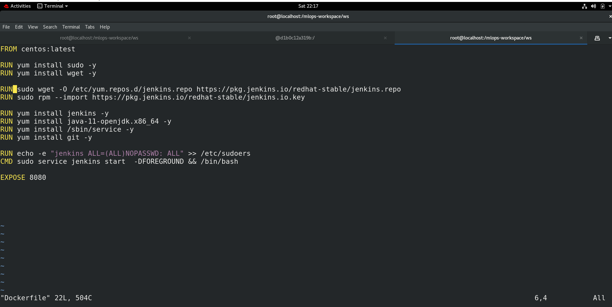

# MLOps & DevOpsAssemblyLines Task-02
## Project:Complete Automation of Web-Application Deployment and Testing

## Description:
#### 1. Create container image that’s has Jenkins installed using dockerfile.
#### 2. When we launch this image, it should automatically starts Jenkins service in the container.
#### 3. Create a job chain of job1, job2, job3 and job4 using build pipeline plugin in Jenkins.
#### 4. Job1 : Pull the Github repo automatically when some developers push repo to Github.
#### 5. Job2 : By looking at the code or program file, Jenkins should automatically start the respective language interpreter install image container to deploy code ( eg. If code is of PHP, then Jenkins should start the container that has PHP already installed ).
#### 6. Job3 : Test your app if it is working or not. If app is not working , then send email to developer with error messages.
#### 7. Job4 : If container where app is running. fails due to any reson then this job should automatically start the container again.

### Step1: Git and GitHub
  * Create a repository on GitHub, initialize with read me, and then clone it on your local Git.
  * In this repository I have created 3 files:
   1. index.html --> This contains my webpage code.
   2. email2.py --> It will be used by jenkins to send the mail to the developer.
   3. myssh-keygen-script.sh --> This is a shell script, It will automatically create a key for your jenkins container using ssh-keygen. Then it will send the key to your 
     BaseOS using ssh-copy-id for remote login. 

### Step2: RedHat OS
  * Run Docker services in your Redhat OS.
  * Create a volume in your redhat os to link with the container afterwards
  
  * Create a Dockerfile to build container image that has jenkins installed it it and all its dependencies.
  
  * Build this image using this command
  
  * Launch the container, It will start Jenkins service automatically inside the container.
  

### Step3:Setup Jenkins Jobs

#### Job1: For fetching repo from GitHub
This job will pull the repository from github whenever developer pushes the code to Github. This job has a build trigger Poll SCM enabled in it that will check every minute if there is any update in github inorder to fetch the repository.

#### Job2: For launching container
This job is interesting, It will check the code/program file then automatically launch container after having the respective language interpreter installed in it. This job is also chained with Job1. It will run only when Job1 is successfully build.

#### Job3: For Testing
This job tests our web application. If the web application is running then the job will build successfully otherwise it will fail and it will send email to developer that the job is failed so that developer can update the code and pushes the new code to github .

#### Job4: For monitoring container
This Job is used for monitoring purpose. It will automatically launch the container if for some reason container is down.

### Dashboard

## Hooray! The task is done. 
